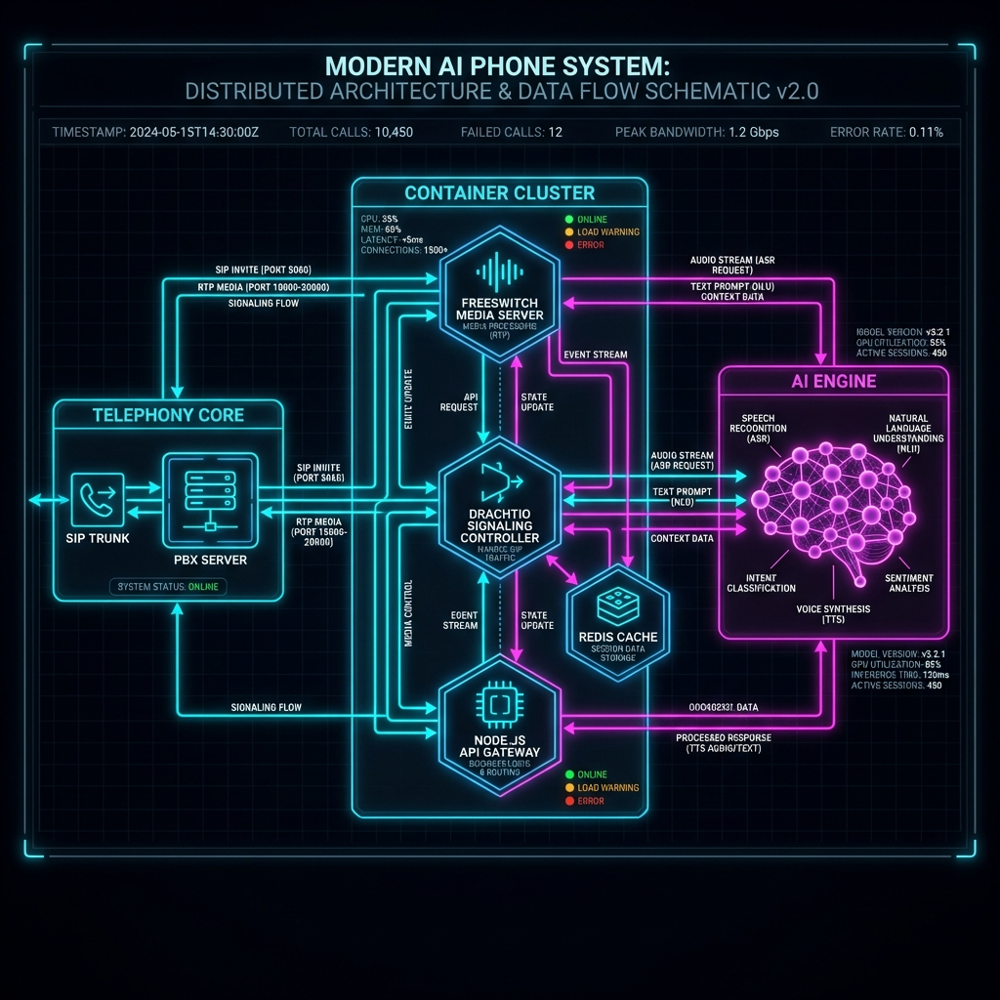

<p align="center">
  
  
</p>

# Gemini Phone

Voice interface for Gemini Code via SIP/FreePBX. Call your AI, and your AI can call you.

## What is this?

Gemini Phone gives your Gemini Code installation a phone number. You can:

- **Inbound**: Call an extension and talk to Gemini - run commands, check status, ask questions
- **Outbound**: Your server can call YOU with alerts, then have a conversation about what to do

## Prerequisites

| Requirement | Where to Get It | Notes |
|-------------|-----------------|-------|
| **FreePBX Account** | [freepbx.org](https://www.freepbx.org/) | Free tier works |
| **ElevenLabs API Key** | [elevenlabs.io](https://elevenlabs.io/) | For text-to-speech |
| **OpenAI API Key** | [platform.openai.com](https://platform.openai.com/) | For Whisper speech-to-text |
| **Gemini Code CLI** | [geminicli.com](https://geminicli.com/) | Requires Gemini subscription |

## Platform Support

| Platform | Status |
|----------|--------|
| **macOS** | Fully supported |
| **Linux** | Fully supported (including Raspberry Pi) |
| **Windows** | Not supported (may work with WSL) |

## Quick Start

### 1. Install

```bash
# Usage: curl -sSL https://raw.githubusercontent.com/jayis1/2fast2dumb2fun/main/install.sh | bash
```

The installer will:

- Check for Node.js 18+, Docker, and git (offers to install if missing)
- Clone the repository to `~/.gemini-phone-cli`
- Install dependencies
- Create the `gemini-phone` command

### Architecture



### 2. Setup

```bash
gemini-phone setup
```

The setup wizard asks what you're installing:

| Type | Use Case | What It Configures |
|------|----------|-------------------|
| **Voice Server** | Pi or dedicated voice box | Docker containers, connects to remote API server |
| **API Server** | Mac/Linux with Gemini Code | Just the Gemini API wrapper |
| **Both** | All-in-one single machine | Everything on one box |

### 3. Start

```bash
gemini-phone start
```

## Deployment Modes

### All-in-One (Single Machine)

Best for: Mac or Linux server that's always on and has Gemini Code installed.

```text
┌─────────────────────────────────────────────────────────────┐
│  Your Phone                                                  │
│      │                                                       │
│      ↓ Call extension 9000                                  │
│  ┌─────────────┐                                            │
│  │   FreePBX   │  ← Cloud PBX                               │
│  └──────┬──────┘                                            │
│         │                                                    │
│         ↓                                                    │
│  ┌─────────────────────────────────────────────┐           │
│  │     Single Server (Mac/Linux)                │           │
│  │  ┌───────────┐    ┌───────────────────┐    │           │
│  │  │ voice-app │ ←→ │ gemini-api-server │    │           │
│  │  │ (Docker)  │    │ (Gemini Code CLI) │    │           │
│  │  └───────────┘    └───────────────────┘    │           │
│  └─────────────────────────────────────────────┘           │
└─────────────────────────────────────────────────────────────┘
```

**Setup:**

```bash
gemini-phone setup    # Select "Both"
gemini-phone start    # Launches Docker + API server
```

### Split Mode (Pi + API Server)

Best for: Dedicated Pi for voice services, Gemini running on your main machine.

```text
┌─────────────────────────────────────────────────────────────┐
│  Your Phone                                                 │
│      │                                                      │
│      ↓ Call extension 9000                                  │
│  ┌─────────────┐                                            │
│  │   FreePBX   │  ← Cloud PBX                               │
│  └──────┬──────┘                                            │
│         │                                                   │
│         ↓                                                   │
│  ┌─────────────┐         ┌─────────────────────┐            │
│  │ Raspberry Pi │   ←→   │ Mac/Linux with      │            │
│  │ (voice-app)  │  HTTP  │ Gemini_CLI          │            │
│  └─────────────┘         │ (gemini-api-server) │            │
│                          └─────────────────────┘            │
└─────────────────────────────────────────────────────────────┘
```

**On your Pi (Voice Server):**

```bash
gemini-phone setup    # Select "Voice Server", enter API server IP when prompted
gemini-phone start    # Launches Docker containers
```

**On your Mac/Linux (API Server):**

```bash
gemini-phone api-server    # Starts Gemini API wrapper on port 3333
```

Note: On the API server machine, you don't need to run `gemini-phone setup` first if you use `gemini login`. If you prefer using an API key, run `gemini-phone setup` and provide your `GEMINI_API_KEY`.

## CLI Commands

| Command | Description |
|---------|-------------|
| `gemini-phone setup` | Interactive configuration wizard |
| `gemini-phone start` | Start services based on installation type |
| `gemini-phone stop` | Stop all services |
| `gemini-phone status` | Show service status |
| `gemini-phone doctor` | Health check for dependencies and services |
| `gemini-phone api-server [--port N]` | Start API server standalone (default: 3333) |
| `gemini-phone device add` | Add a new device/extension |
| `gemini-phone device list` | List configured devices |
| `gemini-phone device remove <name>` | Remove a device |
| `gemini-phone logs [service]` | Tail logs (voice-app, drachtio, freeswitch) |
| `gemini-phone config show` | Display configuration (secrets redacted) |
| `gemini-phone config path` | Show config file location |
| `gemini-phone config reset` | Reset configuration |
| `gemini-phone backup` | Create configuration backup |
| `gemini-phone restore` | Restore from backup |
| `gemini-phone update` | Update Gemini Phone |
| `gemini-phone uninstall` | Complete removal |

## Device Personalities

Each SIP extension can have its own identity with a unique name, voice, and personality prompt:

```bash
gemini-phone device add
```

Example devices:

- **Morpheus** (ext 9000) - General assistant
- **Cephanie** (ext 9002) - Storage monitoring bot

## API Endpoints

The voice-app exposes these endpoints on port 3000:

| Method | Endpoint | Purpose |
|--------|----------|---------|
| POST | `/api/outbound-call` | Initiate an outbound call |
| GET | `/api/call/:callId` | Get call status |
| GET | `/api/calls` | List active calls |
| POST | `/api/query` | Query a device programmatically |
| GET | `/api/devices` | List configured devices |

See [Outbound API Reference](voice-app/README-OUTBOUND.md) for details.

## Troubleshooting

### Quick Diagnostics

```bash
gemini-phone doctor    # Automated health checks
gemini-phone status    # Service status
gemini-phone logs      # View logs
```

### Common Issues

| Problem | Likely Cause | Solution |
|---------|--------------|----------|
| Calls connect but no audio | Wrong external IP | Re-run `gemini-phone setup`, verify LAN IP |
| Extension not registering | SBC/Proxy not running | Check FreePBX admin panel |
| "Sorry, something went wrong" | API server unreachable | Check `gemini-phone status` |
| Port conflict on startup | SBC using port 5060 | Setup auto-detects this; re-run setup |

See [Troubleshooting Guide](docs/TROUBLESHOOTING.md) for more.

## Configuration

Configuration is stored in `~/.gemini-phone/config.json` with restricted permissions (chmod 600).

```bash
gemini-phone config show    # View config (secrets redacted)
gemini-phone config path    # Show file location
```

## Development

```bash
# Run tests
npm test

# Lint
npm run lint
npm run lint:fix
```

## Documentation

- [CLI Reference](cli/README.md) - Detailed CLI documentation
- [Troubleshooting](docs/TROUBLESHOOTING.md) - Common issues and solutions
- [Outbound API](voice-app/README-OUTBOUND.md) - Outbound calling API reference
- [Deployment](voice-app/DEPLOYMENT.md) - Production deployment guide
- [Gemini Code Skill](docs/GEMINI-CODE-SKILL.md) - Build a "call me" skill for Gemini Code

## License

MIT

**

    .-----------------.
    |  Hi, I'm Gemini |
    |      Phone!     |
    |  .-----------.  |
    |  |  /*\\  _  |  |
    |  | |   | | | |  |
    |  | \\*/  |*| |  |
    |  '-----------'  |
    | [1] [2] [3] |\\  |
    | [4] [5] [6] | | |
    | [7] [8] [9] | | |
    | [*] [0] [#] | | |
    '-------------' | |
      |*______**|**/


    .-----------------.
    |                 |
    |   (o)   (o)     |
    |      <          |
    |    \___/        |
    |                 |
    |   CHILL MODE    |
    |      ON         |
    |                 |
    '-----------------'
       _||_//__
      /        \
      |  🌿    |
      \________/

               .
              . .
             . . .
            . . . .
           . . . . .
           . . . . .
          .   . .   .
         .     .     .
        .       .       .
       .        |        .
                |
                |


                    ,
                   dM
                   MMr
                  4MMML                  .
                  MMMMM.                xf

.                "M6MMM               .MM-
   Mh..          +MM5MMM            .MMMM
   .MMM.         .MMMMML.          MMMMMh
    )MMMh.        MM5MMM         MMMMMMM
     3MMMMx.     'MMM3MMf      xnMMMMMM"
     '*MMMMM      MMMMMM.     nMMMMMMP"
       *MMMMMx    "MMM5M\    .MMMMMMM=
        *MMMMMh   "MMMMM"   JMMMMMMP
          MMMMMM   GMMMM.  dMMMMMM            .
           MMMMMM  "MMMM  .MMMMM(        .nnMP"
..          *MMMMx  MMM"  dMMMM"    .nnMMMMM*
 "MMn...     'MMMMr 'MM   MMM"   .nMMMMMMM*"
  "4MMMMnn..   *MMM  MM  MMP"  .dMMMMMMM""
    ^MMMMMMMMx.  *ML "M .M*  .MMMMMM**"
       *PMMMMMMhn. *x > M  .MMMM**""
          ""**MMMMhx/.h/ .=*"
                   .3P"%....
                nP"     "*MMnx
----------------------------------------------
