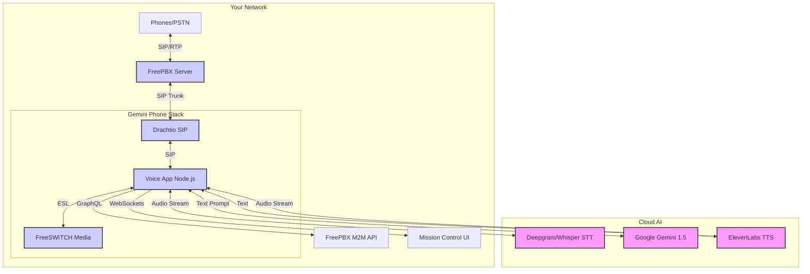

# 🤖 Gemini AI Call Center

### The "AI Employees" for your FreePBX System

[](https://opensource.org/licenses/MIT)
[](https://deepmind.google/technologies/gemini/)
[](https://www.freepbx.org/)

**Turn your FreePBX system into an AI Call Center in minutes.**
Gemini Phone allows you to deploy fully autonomous "AI Employees" (Stacks) that live on your phone network. They can answer calls, transfer customers, take messages, and even call each other to coordinate tasks.

---

## 🚀 Quick Start (One-Line Install)

Run this on any Linux machine (Ubuntu/Debian/Pi) on the same LAN as your FreePBX:

```bash
curl -sSL https://raw.githubusercontent.com/jayis1/claude-phone-but-for-Gemini-and-freepbx/MIssionweedSNACKS/install.sh | bash
```

Run setup:

```bash
gemini-phone setup
gemini-phone start
```

---

## 🏢 What is an "AI Call Center"?

Instead of just one AI bot, this system orchestrates **Teams of AIs**.

### The Architecture

- **Mission Control**: A dashboard to manage your AI workforce.
- **Stacks (AI Employees)**: Each "Stack" is a dedicated independent AI agent with its own:
  - **Phone Extension** (e.g., 9000, 9010, 9020)
  - **Voice** (ElevenLabs / Google)
  - **Personality** (System Prompt)
  - **Memory** (Context)
- **Synx PBX**: Auto-magically configures your FreePBX. No manual trunk/route setup needed.

### Example Team

1. **Morpheus (Ext 9000)**: Level 1 Support. Answers all incoming calls. Filters spam.
2. **Trinity (Ext 9010)**: Specialist. Morpheus transfers technical questions to her.
3. **Neo (Ext 9020)**: Outbound Sales. Calls leads from a list.

---

## 🧠 Features

- **Multi-Modal AI**: Powered by Gemini 1.5 Pro/Flash.
- **Natural Voice**: Ultra-low latency TTS via ElevenLabs.
- **Smart Routing**: AIs can use the PBX to transfer calls (`"Let me transfer you to billing..."` -> *Transfers to Ext 200*).
- **"Synx PBX"**: One-click provisioning of Extensions, Trunks, and Inbound Routes on FreePBX.
- **Mission Control**: Real-time dashboard to see who is talking, view logs, and manage stacks.
- **Technical Architecture**: A clean, serious diagram showing the *Elite Mesh Architecture*, including Active Call Stats, Async n8n Control Loop, and Inter-AI SIP Links.

### Technical Architecture Diagram




---

## 🛠️ Usage

### CLI Commands

Everything is managed via the `gemini-phone` tool.

| Command | Description |
| :--- | :--- |
| `gemini-phone setup` | Hardware/Network wizard. |
| `gemini-phone start` | Wake up the workforce. |
| `gemini-phone stop` | Send everyone home. |
| `gemini-phone status` | See who is online. |
| `gemini-phone doctor` | Diagnose connectivity/network issues. |
| `gemini-phone stack deploy [N]` | Hire a new AI (Deploy Stack N). |
| `gemini-phone stack remove [N]` | Fire an AI (Remove Stack N). |

### Mission Control

Visit `http://YOUR_SERVER_IP:3030` to access the GUI.

- **Green Dot**: Online & Registered with PBX.
- **Red Dot**: Offline (Check `gemini-phone doctor`).
- **Apply Config**: Force FreePBX to reload settings.

---

## 🔧 Advanced: Inter-AI Communication

Your AI agents can talk to each other!
Because they are standard SIP extensions, you can set up scenarios where:

1. **Morpheus** receives an inbound call.
2. User asks a complex math question.
3. **Morpheus** says "Hold on, let me ask the professor."
4. **Morpheus** initiates a second call leg to **Trinity** (Ext 9010).
5. AIs converse, solve the problem, and report back to the user.

*(Future update: creating "Conference Room" scenarios for multi-agent swarms)*

---

## 📦 Requirements

- **Linux Server** (Ubuntu 20.04+, Debian 11+, Raspberry Pi OS 64-bit)
- **FreePBX Server** (v15+) on the same LAN.
- **Gemini API Key** (Google AI Studio)
- **ElevenLabs API Key** (Voice)
- **OpenAI API Key** (Whisper STT)

---

## 🤝 Contributing

We are building the future of open-source AI telephony.

- **Repo**: `jayis1/claude-phone-but-for-Gemini-and-freepbx`
- **Issues**: Submit bugs on GitHub.
- **Feature Requests**: Join the discussion.

---
*Built with ❤️ by NetworkChuck Community & The "Antigravity" Agent*
